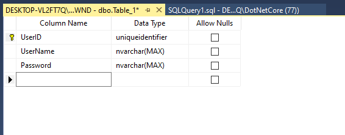

# Datos

Fecha:

Integrantes:

# Dependencias

Para la conexion con la base de datos, se utilizo EntityFrameworkCore. Se instalo a travez del Packet Manager de Nugget, con Visual Studio.

Microsoft.EntityFrameworkCore
Microsoft.EntityFrameworkCore.Tools
Microsoft.EntityFrameworkCore.SqlServer


# Base de datos

Se utilizo la base de datos Northwind, la cual obtuvimos del siguiente repositorio de git: https://github.com/cjlee/northwind

Posteriormente, se realizo el scaffolding de la base de datos con el siguiente comando:

    Scaffold-DbContext "Server=<NombreServidor>\SQLEXPRESS01;Database=<NombreDB>;Trusted_Connection=True;" Microsoft.EntityFrameworkCore.SqlServer

En este caso, se utilizo el medio de autentificacion de login con Windows, en vez de login con credenciales de SQL, por lo que la connection string podria variar.

**Aparte de importar Northwind, tambien se creo una nueva tabla llamada Usuarios, con las siguientes columnas:**




# Arquitectura del proyecto


## Carpeta Database

Al hacer el Scaffolding, se creara la carpeta Database. Esta carpeta cuenta con varias clases, las cuales son los modelos de cada una de las tablas en la base de datos. Tambien se encuentra en esta carpeta, la clase NORTHWNDContext (Esta clase cambia con el nombre de la base de datos, por lo que podria diferir al hacer scaffolding en otro sistema). Esta clase nos permite realizar la conexion con la base de datos, y nos provee de varios metodos que nos ayudan a realizar operaciones con la informacion en la base de datos.

## Carpeta Models

En la carpeta Models, creamos otra vez Modelos de cada una de las entidades. Sin embargo, la diferencia entre estos modelos y los creados por el Scaffolding, yace principalmente en la cantidad de datos. Dado que en nuestra aplicacion no ocuparemos recibir o enviar todos los datos de cada tabla, creamos modelos mucho mas manejables para trabajar con ellos, y unicamente de las entidades que realmente ocuparemos.

Encontraremos los modelos ProductModel.cs, que cuenta unicamente con 4 propiedades, y UserModel, que cuenta con 2 solamente. Como podemos ver, es mucho mas facil trabajar con estos modelos.

## Carpeta Controllers

En esta carpeta, se encuentran los controladores. Es decir, las clases que manejan los endpoints de nuestra API. Sin embargo, estos archivos no hacen demasiado, ya que unicamente llaman a los servicios dependiendo del endpoint, y los servicios (en la carpeta Backend), se encargan de realizar todas las operaciones con los datos, como recibir los productos del NORTHWNDContext.cs.

Por ejemplo, en esta funcion en la clase ProductsController.cs, se recibe un ProductModel mediante una peticion POST, y unicamente se envia al servicio ProductService, con la funcion AddNewProduct()

```csharp
[HttpPost]
public void Post([FromBody] ProductModel newProduct)
{
    new ProductService().AddNewProduct(newProduct);
}
```

## Carpeta Backend

Como ya se menciono antes, la carpeta Backend contiene los Servicios. Estos servicios reciben un Modelo o ID, ya sea de producto o usuario, y realizan operaciones con estos, ya sea crear una nueva entrada en la base de datos, o actualizar/eliminar/retornar una existente.

Por ejemplo, en la funcion AddNewProduct() en ProductService.cs, se recibe un ProductModel (el modelo simplificado que creamos), y se crea un modelo Product (el generado por el Scaffolding). Ya con este nuevo modelo generado, se hace uso del DataContext, de tipo NORTHWNDContext (el contexto de la base de datos), para insertar este nuevo producto.

```csharp
public void AddNewProduct(ProductModel newProduct)
{
    var newProductInDatabase = new Product();

    newProductInDatabase.ProductName = newProduct.ProductName;
    newProductInDatabase.Discontinued = newProduct.Discontinued;
    newProductInDatabase.UnitPrice = newProduct.UnitPrice;

    // Este es el equivalente a hacer un INSERT INTO PRODUCTS
    DataContext.Products.Add(newProductInDatabase);
    DataContext.SaveChanges();

}
```
